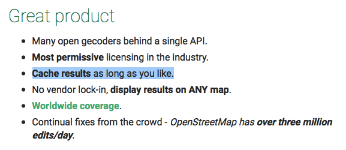

# revgeod

A reverse Geo lookup thing, accessible via HTTP and backed via [OpenCage](https://opencagedata.com), our geocoder of choice. You'll need an API key exported into the environment, and you can specify _revgeod_'s listen IP address and port which default to `127.0.0.1` and `8865` respectively.

```bash
#!/bin/sh

export OPENCAGE_APIKEY="xxxxxxxxxxxxxxxxxxxxxxxxxxxxxxxx"
export REVGEO_IP=127.0.0.1
export REVGEO_PORT=8865

mkdir -p data/geocache/

exec ./revgeod
```

The `data/geocache/` directory (currently hardcoded) must exist and be writeable; that's where the LMDB database is stored. _revgeod_ caches OpenCage's responses (they explicitly permit this):



## example

```bash
$ curl -i 'http://127.0.0.1:8865/rev?lat=48.85593&lon=2.29431'
HTTP/1.1 200 OK
Connection: Keep-Alive
Content-Length: 111
Content-type: application/json
Date: Tue, 23 Oct 2018 13:10:12 GMT
```
```json
{"address":{"village":"4 r du Général Lambert, 75015 Paris, France","locality":"Paris","cc":"FR","s":"opencage"}}
```

A second query for the same location would respond with `lmdb` instead of `opencage` as the source, indicating it's been cached.

```json
{"address":{"village":"4 r du Général Lambert, 75015 Paris, France","locality":"Paris","cc":"FR","s":"lmdb"}}
```

## statistics

_revgeod_ provides statistics on its `/stats` endpoint:

```json
{
   "stats": {
      "_whoami": "revgeod.c",
      "_version": "0.1.8",
      "stats": 8,
      "requests": 13647,
      "geocode_failed": 9,
      "opencage": 13624,
      "lmdb": 23
   },
   "uptime": 381258,
   "uptime_s": "4 days, 9 hours, 54 mins",
   "tst": 1544555424,
   "db_path": "/usr/local/var/revgeod/geocache/",
   "db_entries": 43756,
   "db_size": 7532544
}
```

## options

The following command-line switches are supported:

* `-d`: dump content of database (all keys/values) to stdout
* `-D`: dump content of database (all keys/values) to stdout, lines prefixed by lat,lon
* `-q`: query individual geohashes
* `-s`: attempt to connect to _revgeod_ to obtain and print statistics
* `-v`: show version and exit

## requirements

### rhel/centos

```
yum install lmdb
```

### debian

```
apt-get install  liblmdb-dev lmdb-utils
```

### macos

```
brew install jpmens/brew/revgeod
```

This is documented [here](https://github.com/jpmens/homebrew-brew).


## blurbs

1. {"address":{"village":"unknown address","s":"opencage"}}


curl_easy_perform() failed: Timeout was reached: HTTP status code == 0
opencage_millis 4304.350000

2. {"address":{"village":"La Terre Noire, 77510 Sablonnières, France","s":"opencage"}}

3. {"address":{"village":"La Terre Noire, 77510 Sablonnières, France","s":"lmdb"}}


## valgrind

Thanks to [this post](https://blogs.kolabnow.com/2018/06/07/a-short-guide-to-lmdb) I learn that
> in order to run LMDB under Valgrind, the maximum mapsize must be smaller than half your available ram.


## requirements

* [libmicrohttpd](https://www.gnu.org/software/libmicrohttpd/)
* [statsd-c-client](https://github.com/romanbsd/statsd-c-client) (optional)

## author

Jan-Piet Mens `<jp()mens.de>`
